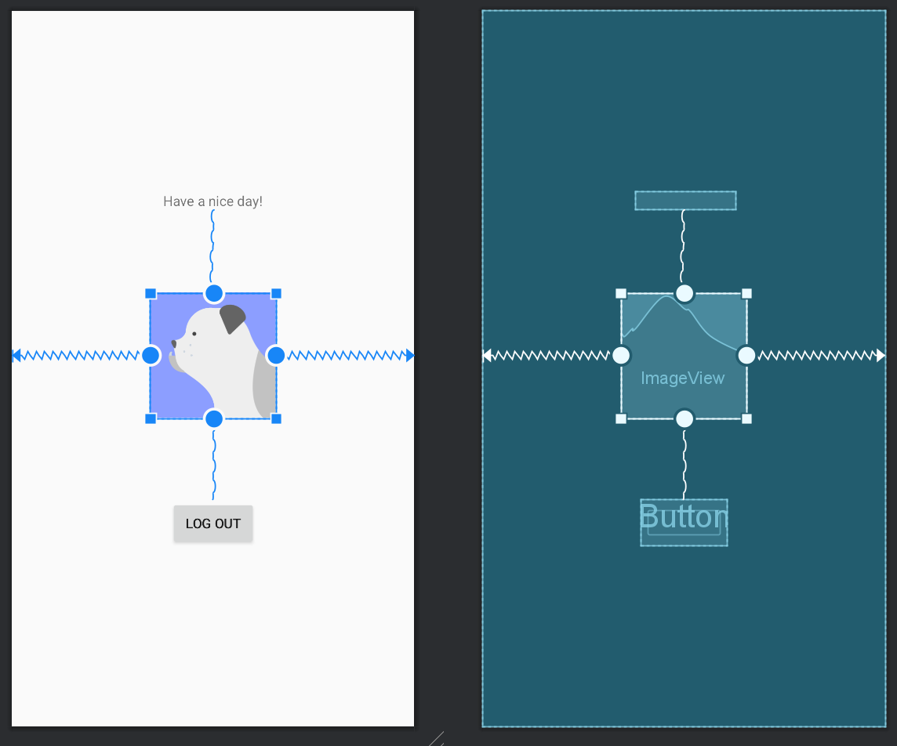

# Rapport

Koden under visar en utav de 3 view som användes men alla 3 utfördes ungefär på samma sätt med att de blev tilldelad constraint åt top, bottom, start och end och även någon typ av margin.
Alla views har även ett id för att kunna skilja på de och kunna skapa ett förhållande mellan varandra ( i detta fall, distans mellan varandra.)
```
<TextView
        android:layout_width="wrap_content"
        android:layout_height="wrap_content"
        app:layout_constraintBottom_toTopOf="@id/imageView"
        app:layout_constraintLeft_toLeftOf="parent"
        app:layout_constraintRight_toRightOf="parent"
        app:layout_constraintTop_toTopOf="parent"
        android:layout_marginTop="100dp"
        android:id="@+id/name"
        android:text="Have a nice day!"
        />
```

Det som skapats för uppgiften är en layout i constraint layout där views lägger sig utifrån de begränsningar som angetts. I design lades views in som en textruta, en plats för en bild och en knapp.
Views fick constraints för att views ska förhålla sig med jämna mellanrum. Efter det lades en margin för att få views att lägga sig mer kompakt. 


